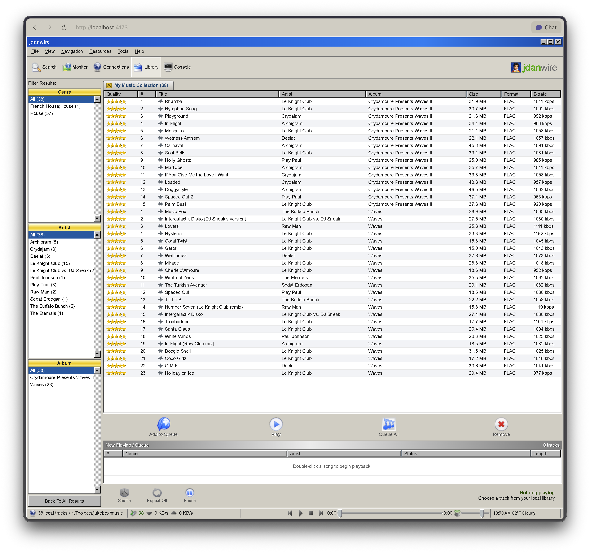

## jdanwire

A retro local music player built with [98.css](https://jdan.github.io/98.css/)

Play it at [jdanwire.jordanscales.com](https://jdanwire.jordanscales.com/).



## Browser library

Use **Choose Music Folder** to open a folder from your computer. The selected
audio files stay in your browser and are never uploaded to the server. On
supported Chromium browsers, jdanwire remembers the folder across reloads and
asks you to reconnect only when the browser requires permission again.

### Run

```sh
npm start -- /path/to/music
```

The music directory argument is required. jdanwire does not assume a default
library location. This server-backed mode is only needed for local development;
the static site works entirely with the browser folder picker.
